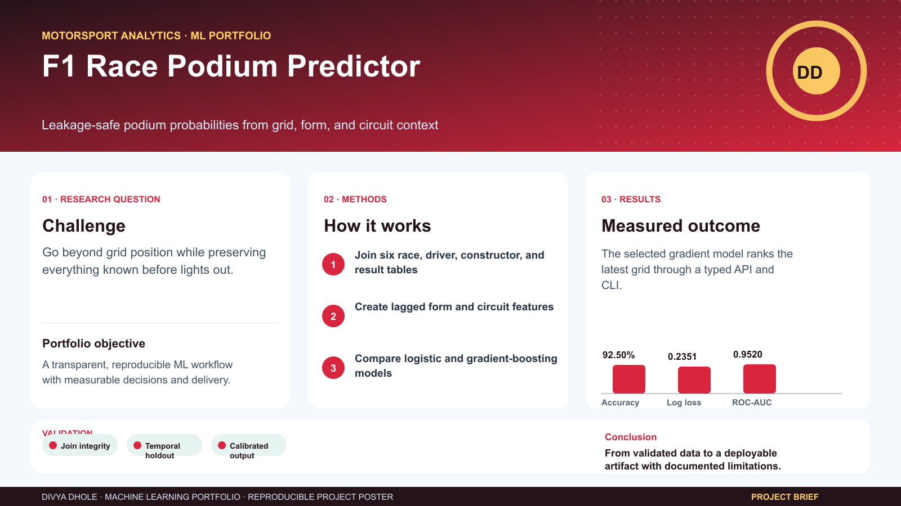
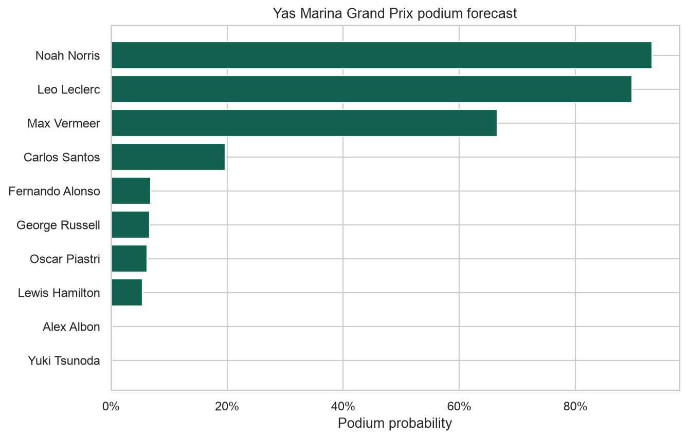
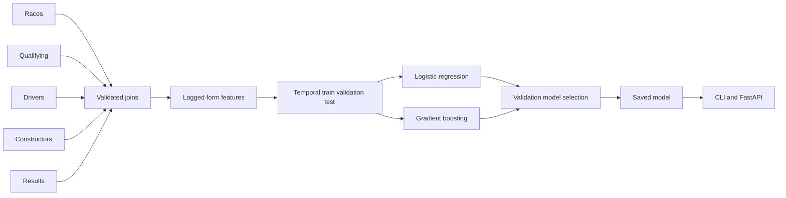
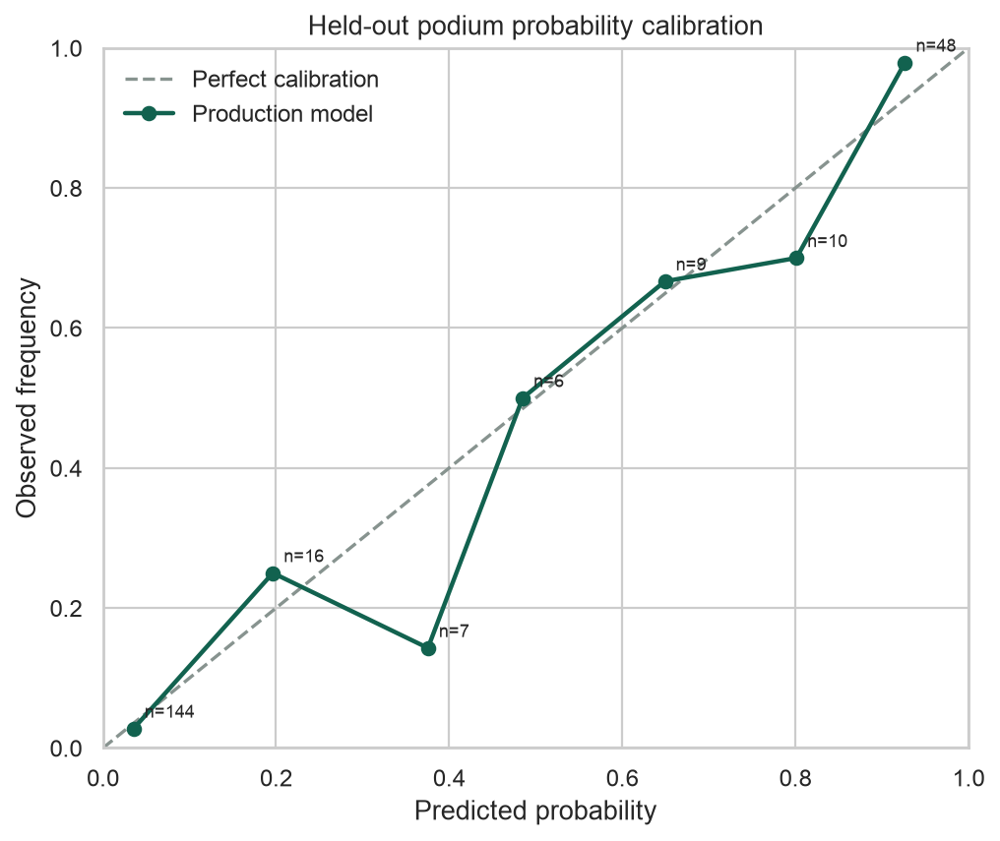
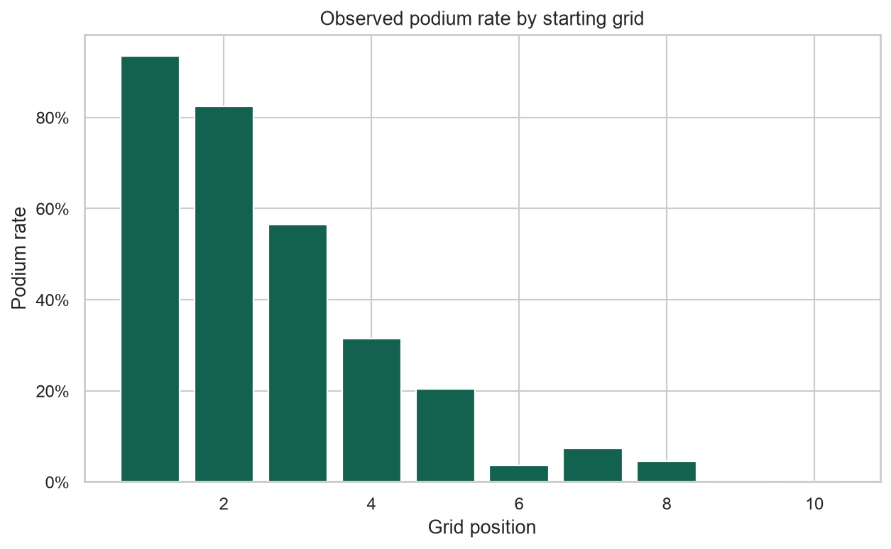

# F1 Race Podium Predictor



A production-style machine learning system that joins Formula 1 race, qualifying, driver, constructor, and result tables to produce leakage-safe podium probabilities.



## Overview

This repository demonstrates the full tabular ML lifecycle: relational data validation, time-aware feature engineering, temporal tuning, benchmark comparison, calibrated probabilities, saved artifacts, CLI/API inference, SQL analysis, testing, CI, and container deployment.

## Problem Statement

Starting grid is highly predictive in Formula 1, but it does not capture driver form, constructor momentum, circuit history, or recent reliability. The project estimates each driver's probability of finishing in the top three while ensuring every feature was available before lights out.

## Architecture



See [Architecture](docs/ARCHITECTURE.md), [Data Card](docs/DATA_CARD.md), [Model Card](docs/MODEL_CARD.md), and [Decisions](docs/DECISIONS.md).

## Technologies

| Area | Tools |
| --- | --- |
| Data | pandas, NumPy, relational CSV tables, SQL |
| Modeling | scikit-learn logistic regression and histogram gradient boosting |
| Evaluation | log loss, Brier score, ROC-AUC, PR-AUC, calibration error |
| Product | FastAPI, Pydantic, argparse CLI |
| Delivery | pytest, Ruff, GitHub Actions, Docker |

## Installation

```bash
python3 -m venv .venv
source .venv/bin/activate
pip install -e '.[dev]'
```

## Setup

Generate the deterministic offline tables and train:

```bash
python scripts/generate_sample_data.py
f1-podium train
python scripts/generate_reports.py
python scripts/generate_examples.py
```

The CSV schemas mirror the Formula 1 Kaggle/Ergast tables. Replace files under `data/raw/` with a compatible downloaded snapshot and retrain.

## Usage

Predict from a typed feature record:

```bash
f1-podium predict examples/prediction-request.json
```

Rank the latest processed grid:

```bash
f1-podium rank-latest --output examples/latest-race-ranking.csv
```

Run the API and open `http://localhost:8000/docs`:

```bash
uvicorn f1_podium.api:app --reload
```

```bash
curl -X POST http://localhost:8000/predict \
  -H 'Content-Type: application/json' \
  --data @examples/prediction-request.json
```

Container deployment:

```bash
docker compose up --build
```

## Features

- Qualifying grid position
- Driver podium rate over the previous five races
- Driver points over the previous five races
- Constructor points over the previous five races
- Driver's prior average finish at the circuit
- Driver reliability over the previous five races
- Fraction of the current season completed

All rolling and expanding features are shifted by one event. The target race never contributes to its own features.

## Results

The calendar split trains through September 2023 and evaluates 240 driver-race rows from March 2024 through September 2025.

| Model | Log loss | Brier | ROC-AUC | PR-AUC | Accuracy | Calibration error |
| --- | ---: | ---: | ---: | ---: | ---: | ---: |
| Gradient boosting | 0.2351 | 0.0650 | 0.9520 | 0.9188 | 92.50% | 0.0241 |
| Logistic regression | 0.2077 | 0.0590 | 0.9642 | 0.9407 | 92.92% | 0.0323 |
| Grid baseline | 0.3014 | 0.0858 | 0.9683 | 0.9192 | 88.33% | 0.1500 |

Gradient boosting was selected on the inner 2023 validation period, where its log loss was 0.2664 versus 0.2707 for logistic regression. The final 2024-2025 results are reported once, without using them to revise that selection.





## Performance

- 1,080 driver-race rows across 108 races and nine seasons
- 840 training rows and 240 out-of-time test rows
- Four gradient-boosting configurations compared on the last training season
- Grid baseline included because it is a strong domain benchmark
- Probability outputs clipped away from 0 and 1 for operational stability

## Validation

```bash
make lint
make test
make validate
```

Tests cover table keys, join cardinality, temporal separation, cold starts, feature completeness, probability bounds, model reload, CLI output, API schemas, metrics, and end-to-end training. CI enforces 85% coverage.

## Limitations

- The committed data is synthetic and intended for reproducible demonstration, not current race forecasting or wagering.
- Ten drivers and five constructors make this sample smaller than a real modern grid.
- Weather, tire compounds, pit-stop strategy, penalties, upgrades, and practice pace are omitted.
- Driver-constructor assignments are fixed in the sample.
- Historical public data needs licensing and provenance review before commercial use.

## Future Improvements

- Train on a versioned Formula 1 World Championship Kaggle snapshot.
- Add weather, tire, lap-time, pit-stop, and penalty features.
- Model driver finishing positions jointly within a race instead of independent probabilities.
- Add season and constructor drift monitoring.
- Calibrate with isotonic regression after collecting a larger validation period.
- Add scheduled race-weekend data refresh and artifact promotion.

## License

MIT. See [LICENSE](LICENSE).
